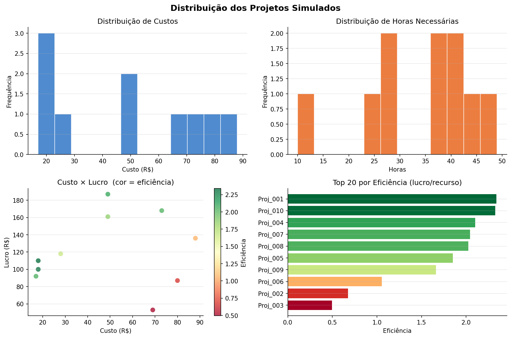
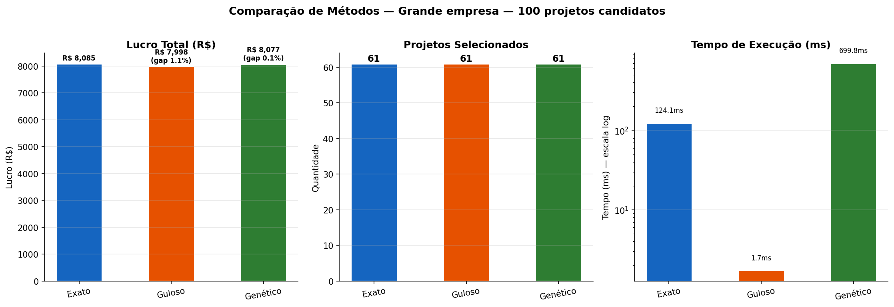
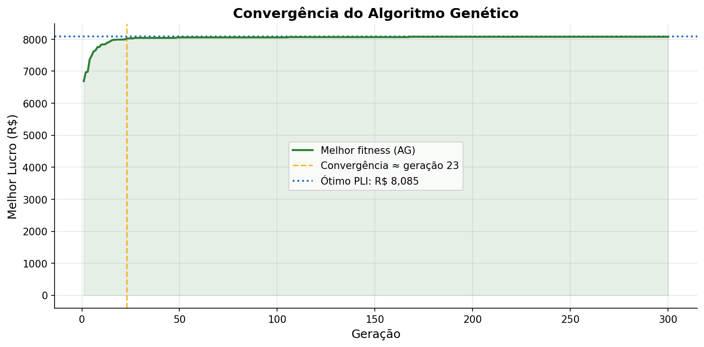
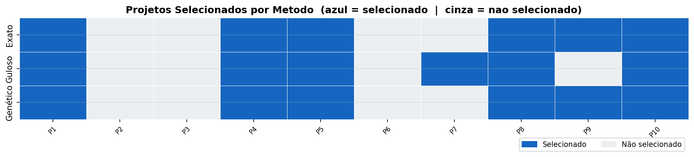
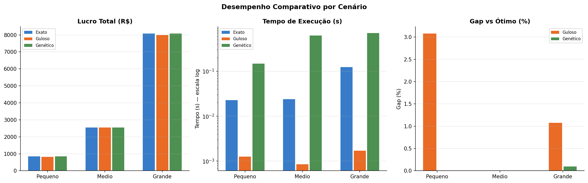

# 📊 Otimização de Alocação de Recursos em Projetos

> **Dashboard interativo para comparação entre solução exata (PLI) e heurísticas (Greedy e Algoritmo Genético) aplicadas a um problema clássico de otimização combinatória.**

[](https://python.org)
[](https://streamlit.io)
[](https://coin-or.github.io/pulp/)
[](LICENSE)

---

## 📌 Sobre o Projeto

Uma empresa precisa decidir **quais projetos executar** dentro de um orçamento limitado e com uma equipe com disponibilidade restrita de horas. Este projeto modela e resolve esse problema como uma **Mochila Multidimensional 0-1** — um problema NP-difícil clássico em otimização combinatória.

Três abordagens são implementadas e comparadas:

| Método | Tipo | Garantia | Complexidade |
|--------|------|----------|-------------|
| Programação Linear Inteira (PLI) | Exato | Ótimo global | NP-difícil |
| Heurística Gulosa (Greedy) | Heurística | Nenhuma | O(n log n) |
| Algoritmo Genético (AG) | Meta-heurística | Nenhuma | O(G × P × n) |

---

## 🖥️ Dashboard Interativo

O projeto inclui um dashboard web completo construído com **Streamlit**:

### Tela inicial — Problema e formulação matemática


### Comparação entre os três métodos


### Convergência do Algoritmo Genético


### Projetos selecionados por método (heatmap)


### Comparação entre cenários (pequeno, médio, grande)


---

## 🧮 Formulação Matemática

**Variáveis de decisão:**

$$x_i \in \{0, 1\}, \quad i = 1, \ldots, n$$

**Maximizar:**

$$Z = \sum_{i=1}^{n} \text{lucro}_i \cdot x_i$$

**Sujeito a:**

$$\sum_{i=1}^{n} \text{custo}_i \cdot x_i \leq B \quad \text{(orçamento)}$$

$$\sum_{i=1}^{n} \text{horas}_i \cdot x_i \leq H \quad \text{(horas da equipe)}$$

$$x_i \in \{0, 1\} \quad \forall i$$

---

## 📁 Estrutura do Projeto

```
otimizacao-alocacao-recursos-python/
│
├── app.py                          # Dashboard Streamlit (interface web)
├── main.py                         # Script de linha de comando
├── requirements.txt
├── README.md
│
├── src/
│   ├── data/
│   │   └── data_generator.py       # Geração de dados simulados e cenários
│   ├── solvers/
│   │   ├── exact_solver.py         # PLI via PuLP + solver CBC
│   │   ├── greedy_solver.py        # Heurística gulosa por eficiência
│   │   └── genetic_solver.py       # Algoritmo Genético com reparo
│   └── visualization/
│       └── plots.py                # Gráficos matplotlib/seaborn
│
├── results/                        # Gráficos gerados automaticamente
└── .streamlit/
    └── config.toml                 # Tema do dashboard
```

---

## 🚀 Como Rodar

### Pré-requisitos

- Python 3.9+

### Instalação

```bash
# 1. Clonar o repositório
git clone https://github.com/seu-usuario/otimizacao-alocacao-recursos-python.git
cd otimizacao-alocacao-recursos-python

# 2. Criar ambiente virtual (recomendado)
python -m venv venv
source venv/bin/activate      # Linux/Mac
venv\Scripts\activate         # Windows

# 3. Instalar dependências
pip install -r requirements.txt
```

### Rodar o Dashboard Web

```bash
streamlit run app.py
```

Acesse **http://localhost:8501** no navegador.

### Rodar via Terminal (sem interface)

```bash
python main.py
```

---

## 📊 Resultados Obtidos

Executando com `seed=42` nos três cenários disponíveis:

### Cenário Pequeno — 10 projetos

| Método | Lucro Total | Gap vs Ótimo | Tempo |
|--------|-------------|-------------|-------|
| PLI (Exato) | R$ 844 | 0% | ~23ms |
| Greedy | R$ 818 | 3.1% | < 1ms |
| Genético (AG) | R$ 844 | 0% | ~150ms |

### Cenário Grande — 100 projetos

| Método | Lucro Total | Gap vs Ótimo | Tempo |
|--------|-------------|-------------|-------|
| PLI (Exato) | R$ 8.085 | 0% | ~125ms |
| Greedy | R$ 7.998 | 1.1% | ~2ms |
| Genético (AG) | R$ 8.077 | 0.1% | ~700ms |

**Principais conclusões:**
- O **PLI** garante a solução ótima em todos os cenários testados
- O **Greedy** é ~60× mais rápido e perde em média apenas 1–3%
- O **AG** encontra soluções quasi-ótimas (gap < 0.5%) no cenário grande

---

## 🔬 Análise de Complexidade

```
PLI (Branch & Bound):
  Complexidade: NP-difícil no pior caso
  Prático: muito rápido para instâncias < 500 variáveis graças ao solver CBC
  Uso: quando a otimalidade é obrigatória

Greedy O(n log n):
  Dominado pela ordenação
  Escala para milhares de projetos sem problema
  Uso: decisões em tempo real, instâncias muito grandes

Algoritmo Genético O(G × P × n):
  G=300 gerações, P=100 população, n=projetos
  Parâmetros configuráveis no dashboard
  Uso: instâncias grandes onde PLI é lento e Greedy perde qualidade
```

---

## 🛠️ Tecnologias

| Biblioteca | Versão | Uso |
|-----------|--------|-----|
| [Streamlit](https://streamlit.io) | ≥ 1.32 | Interface web interativa |
| [PuLP](https://coin-or.github.io/pulp/) | ≥ 2.7 | Modelagem e solução PLI |
| [NumPy](https://numpy.org) | ≥ 1.24 | Operações vetorizadas no AG |
| [Pandas](https://pandas.pydata.org) | ≥ 2.0 | Manipulação dos dados |
| [Matplotlib](https://matplotlib.org) | ≥ 3.7 | Visualizações |
| [Seaborn](https://seaborn.pydata.org) | ≥ 0.12 | Heatmap de seleção |

---

## 🚀 Publicar Online (Streamlit Community Cloud)

1. Faça push do projeto para um repositório **público** no GitHub
2. Acesse [share.streamlit.io](https://share.streamlit.io)
3. Conecte sua conta GitHub
4. Selecione o repositório e o arquivo `app.py`
5. Clique em **Deploy** — em poucos minutos terá um link público

---

## 🔭 Possíveis Melhorias

- [ ] **GRASP** — Greedy Randomized Adaptive Search
- [ ] **Simulated Annealing** com cooling schedule
- [ ] **NSGA-II** — otimização multi-objetivo (lucro × risco)
- [ ] Dependências entre projetos (restrições de precedência)
- [ ] Exportar resultados em CSV/JSON
- [ ] Testes unitários com pytest

---

## 📚 Referências

- Kellerer, H., Pferschy, U., & Pisinger, D. (2004). *Knapsack Problems*. Springer.
- Goldberg, D. E. (1989). *Genetic Algorithms in Search, Optimization, and Machine Learning*.
- Mitchell, M. (1998). *An Introduction to Genetic Algorithms*. MIT Press.
- [Documentação PuLP](https://coin-or.github.io/pulp/)

---

## 👤 Autor

Desenvolvido como projeto de portfólio para pesquisa em otimização combinatória.

---

*Se este projeto foi útil, deixe uma ⭐ no repositório!*
